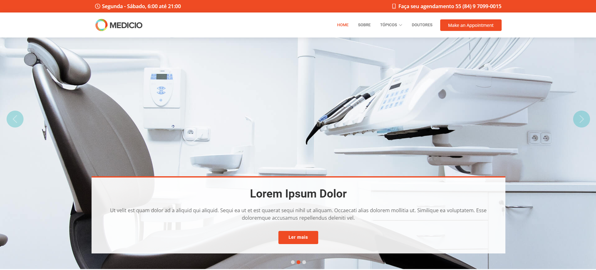
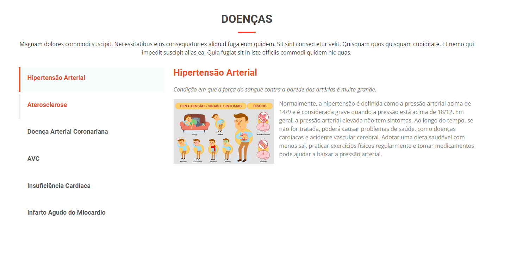
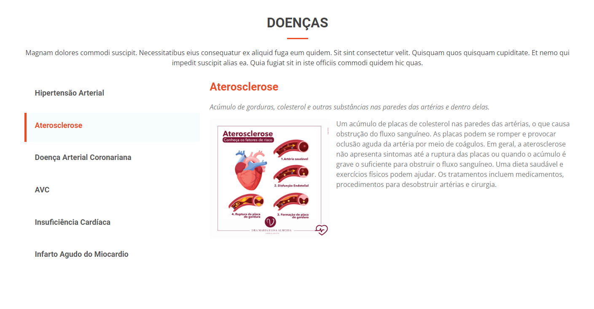
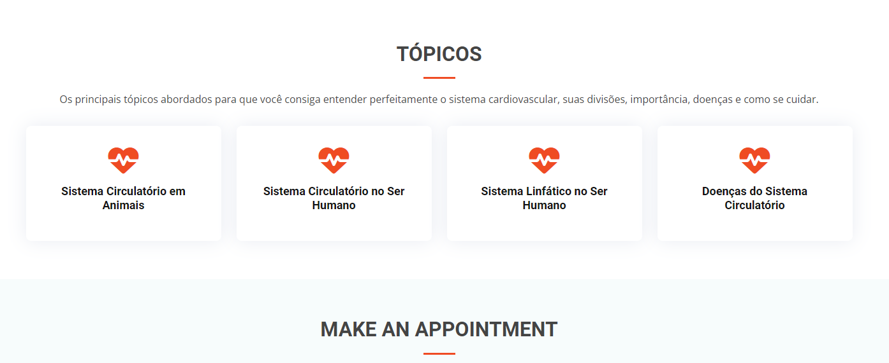
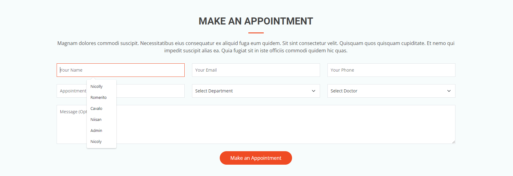

# Heart-Etapa-2 - Relatório

### Ponto 5:
>O grupo deverá escolher trechos do código do template e comentar seu
funcionamento, assim como as classes bootstrap utilizadas e suas funções.
Aconselha-se definir porções de tags \<main> , \<section> \<article>, \<footer>,
\<navbar> etc. Estes comentários deverão ser inseridos no relatório do projeto (ver
próximo item).

O trecho que será analisado, primeiramente, será a **Topics Section**
``` 
<section id="topics" class="featured-topics">
    <div class="container" data-aos="fade-up">
        <div class="section-title">
            <h2>Tópicos</h2>
            <p>
                Os principais tópicos abordados para que você consiga entender
                perfeitamente o sistema cardiovascular, suas divisões,
                importância, doenças e como se cuidar.
            </p>
        </div>
    </div>
</section>
```
Nesse corte é possível notar a presença da classe `"Container"` que será responsável pela adição e organização dos espaçamentos de um modo geral, além do `"section-title"` que marca o início de uma section adicionando a ela um título

```
<div class="row">
    <div class="col-md-6 col-lg-3 d-flex align-items-center justify-content-center mb-5 mb-lg-0 text-center">
        <div class="icon-box" data-aos="fade-up" data-aos-delay="100">
            <div class="icon"><i class="fas fa-heartbeat"></i></div>
            <h4 class="title">
                <a href="">Sistema Circulatório em Animais</a>
            </h4>
        </div>
    </div>
</div>
```
Nessa div é utilizada a classe `"row"` que possui como objetivo iniciar o sistema de grid do bootstrap, isto é, os elementos filhos estarão em meio a uma grid e, portanto, poderão utilizar as classes `"col"`, como demonstrado na parte inferior. As classes `"col-md-6"`, `"col-lg-3"`,`"d-flex"`, `"align-items-center"`, `"justify-content-center"` e todas as que iniciam com `"m"` significam respectivamente: o tamanho da coluna quando o tamanho for mediano, o tamanho da coluna quando o tamanho da tela for larga, adicionar aos elementos filhos o display flex, alinhar todos os itens ao centro, justificar todo o conteúdo ao centro e o restante se refere a quantidade de margem de deve ser aplicada. OBS: Essa div está dentro da primeira `<section>`.

```
<nav id="navbar" class="navbar order-last order-lg-0">
    <ul>
        <li><a class="nav-link scrollto" href="#hero">Home</a></li>
        <li><a class="nav-link scrollto" href="#about">Sobre</a></li>
        <li class="dropdown">
        <a href="#topics"><span>Tópicos</span> <i class="bi bi-chevron-down"></i></a>
        <ul>
            <li><a href="#topics">Visão Geral</a></li>
            <li class="dropdown">
            <a href="#"><span>Deep Drop Down</span>
                <i class="bi bi-chevron-right"></i></a>
            <ul>
                <li><a href="#">Deep Drop Down 1</a></li>
                <li><a href="#">Deep Drop Down 2</a></li>
                <li><a href="#">Deep Drop Down 3</a></li>
                <li><a href="#">Deep Drop Down 4</a></li>
            </ul>
            </li>
            <li><a href="#">Drop Down 2</a></li>
            <li><a href="#">Drop Down 3</a></li>
            <li><a href="#doencas">Doenças</a></li>
        </ul>
        </li>
        <li><a class="nav-link scrollto" href="#doctors">Doutores</a></li>
    </ul>
    <i class="bi bi-list mobile-nav-toggle"></i>
</nav>
```
Agora o ponto mais famosos que são as `<nav>`, elas são utilizadas para, principalmente, indicar barras de navegação, geralmente se encontram no topo do site, as principais classes utilizadas são `"navbar"` e `"nav-link"`, ou seja, enquanto a primeira indica o que será para o bootstrap uma navbar, a segunda indica o que estará dentro, ou melhor, será filha e/ou uma opção dessa barra de navegação. A classe `"dropdown"` indica uma função dessa nav, isto é, ela será um dropdown. Por fim, a classe `"scrollto"` é para que a tela seja "scrollada", desça até o ponto de âncora indicado.


### Ponto 6:
>Ao menos quatro dos seis princípios de Design de Interação devem ser
destacados e explicados. Essa explicação deverá ser feita por meio de relatório a
ser entregue paralelamente ao sistema.


• Visibilidade: Nosso projeto é um site basicamente informativo, logo de cara vemos um texto, que ainda iremos escrever, nele haverá informações sobre a atividade, sobre o grupo e sobre o projeto em si. Levantando o olhar vemos o header, a barra laranja provavelmente vai sumir também e os tópicos mais importantes, que são links para os conteúdos do site estão bem visíveis, o button de Make an Appointment também será alterado. 



• Feedback: Ao buscarmos as doenças nos tópicos aparecerá esta tela, usada como exemplo, sabemos qual doença estamos olhando a diferença de cores na barra lateral. A laranja/vermelha é a que estamos lendo no momento e ao colocarmos o cursor sobre outra doença a fonte ficará colorida e aparecerá a barrinha cinza, mostrando uma resposta a ação do usuário, ao trocarmos de doença as cores da barra irão se alterar também. 


• Consistência: Por ser um modelo bootstrap toda a página é padronizada, seja na tipografia, seja nas cores que estão sempre se repetindo e mesmo que seja usado diferentes layouts durante o projeto, existem algumas consistências, como esse pequeno traço colorido embaixo do título.


• Affordance e Significantes: Essa sessão do nosso site é um formulário, o affordance está sendo utilizado no formato da caixa de texto e na mudança do cursor quando ele é colocado em cima destas e junto com ela existe um significante, aparecendo na forma da borda colorida quando clicamos para preencher os dados.